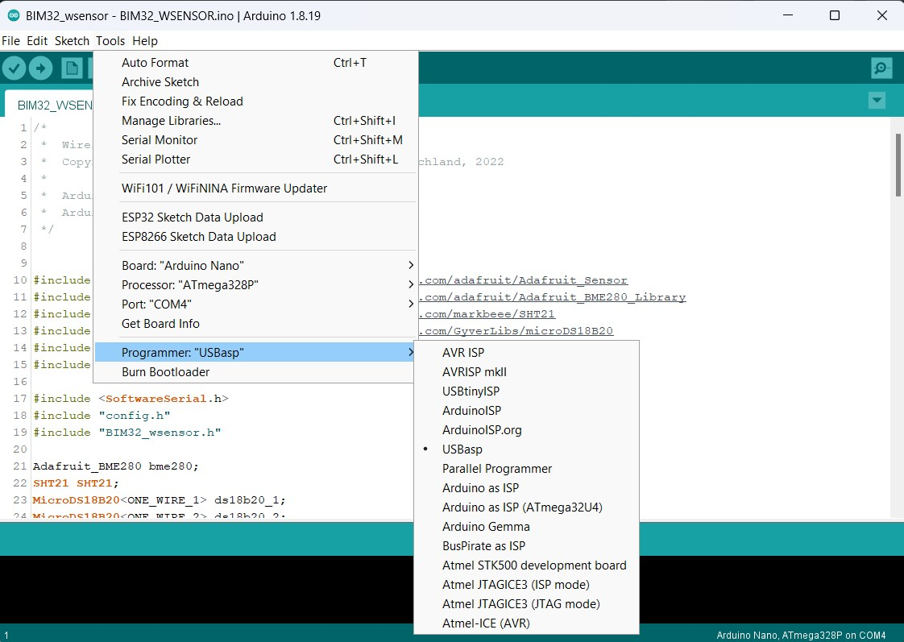
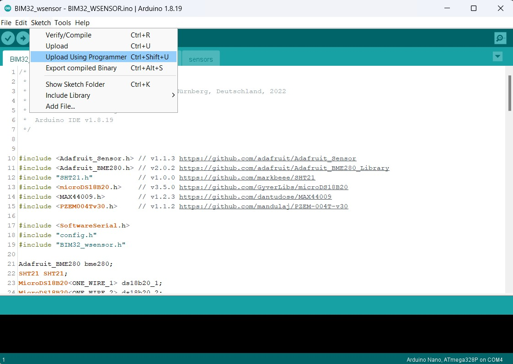
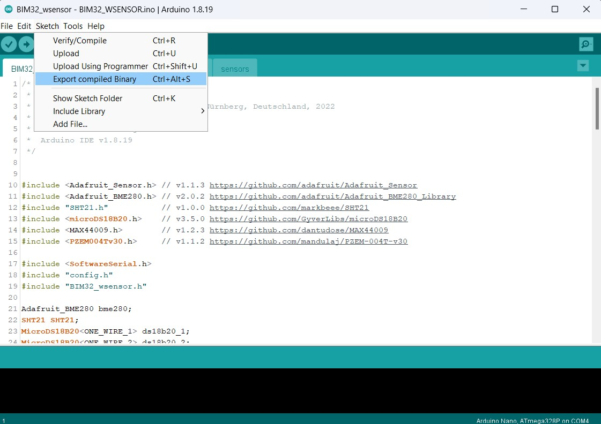

# Radio-sensor

The radio-sensor is designed to work with the Weather Monitor BIM32. It can work indoors or outdoors. Powered by three AAAA batteries (LR61). Currently the radio-sensor supports the following sensors:
  * BME280 - temperature, humidity and atmospheric pressure sensor
  * SHT21 - temperature and humidity sensor
  * DS18B20 - temperature sensor (four such sensors can be connected at once)
  * MAX44009 - ambient light sensor
  * PZEM-004t - electricity meter (voltage, current, power, energy consumption, network frequency)
  * SenseAir S8 - CO2 sensor

Of course, you don’t need to connect everything from this list, but only those sensors that you need.

The radio sensor is based on the Atmega328p microcontroller and the HC-12 radio module. This radio module operates at a frequency from 433.4 to 473.0 MHz and promises an information transmission range of up to 1800 meters.

## Radio-sensor schematic diagramm
The **Radio-sensor** itself can be assembled on the **Arduino Nano** module, or any other module built on the **atmega328p**. In this case, the circuit, assembly and flashing of the **Radio-sensor** will be as simple as possible, but in this form you can forget about the autonomous power supply of the sensor.

Or you can go a more complicated way, assemble the **Radio-sensor** from *SMD-components* and flash it with a programmer. In this case, the **Radio-sensor** will be able to live from three AA batteries for almost a year.

## Radio-sensor firmware
To flash the **Radio-sensor** you need to open the project in the Arduino IDE, go to the **config.h** tab and uncomment (remove the characters **//** at the beginning of the line) the necessary sensors. If you have 2 radio-sensors - at the end of this file in the line **const int SENSOR_NUMBER = 0;** for the first sensor leave the value **0**, and for the second change **0** to **1**.

If your sensor is built on **Arduino module** then just flash it as usual.

And if on ***SMD-components*** - select in the Arduino IDE **Tools** -> **Programmer** -> **Your type of programmer**

Then click on the menu **Sketch** -> **Download via programmer**

If Ardino does not have your programmer, select **Sketch** -> **Export binary file** from the menu.

After compilation, two **.hex** files will appear in the project folder, you need the **BIM32_Radio-sensor.ino.eightanaloginputs.hex** one. And you need to flash it into **atmega328p** using a programmer. Set the fuses as in the screenshot below.

