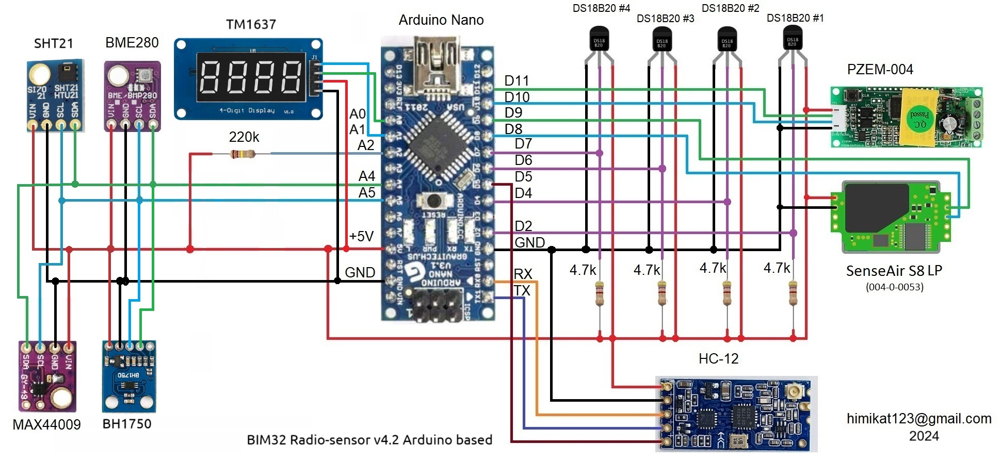
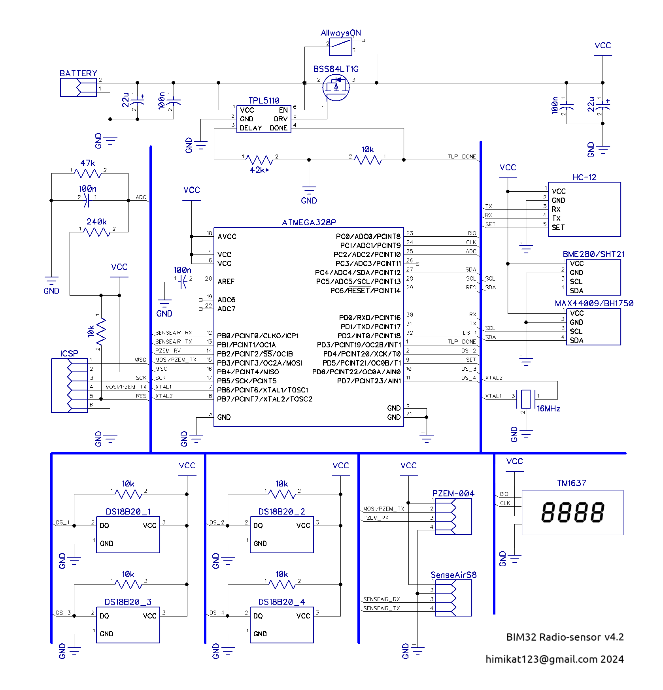
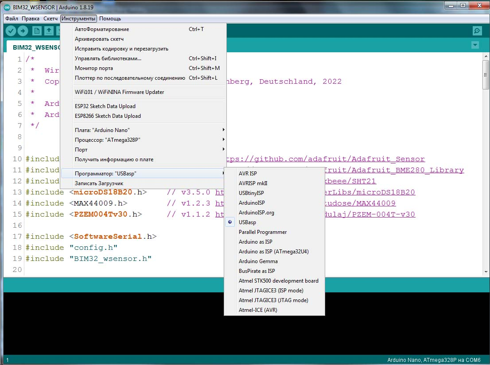
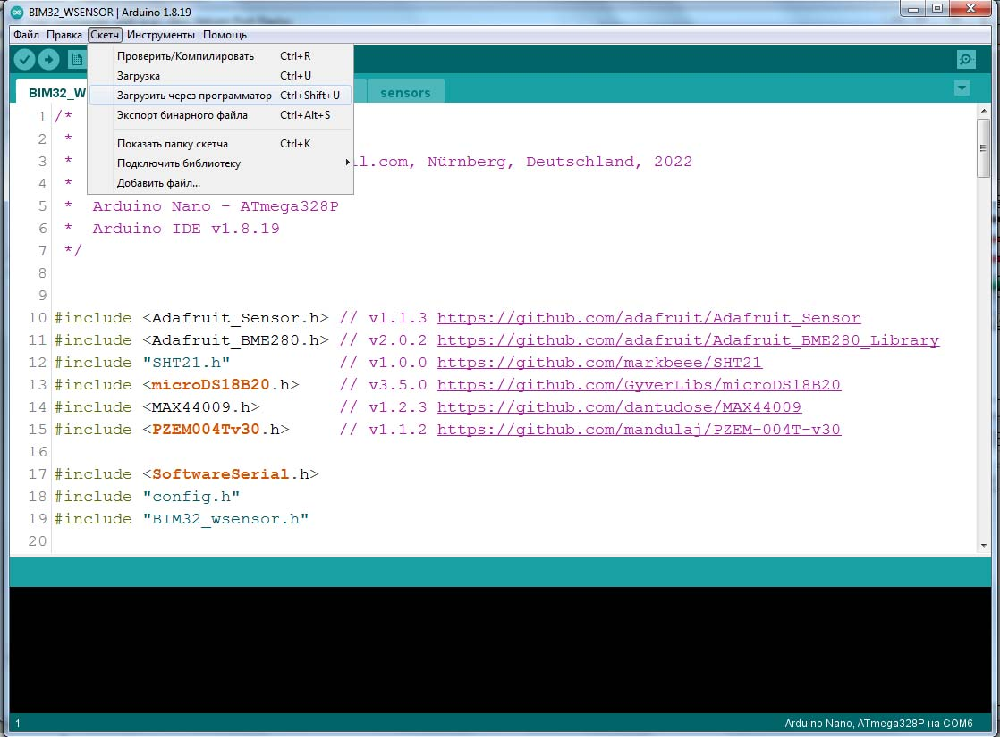
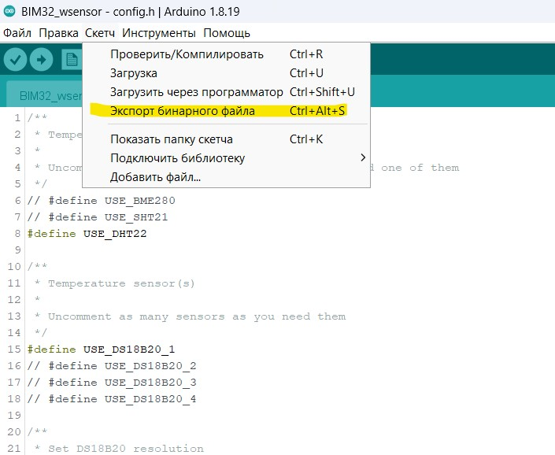
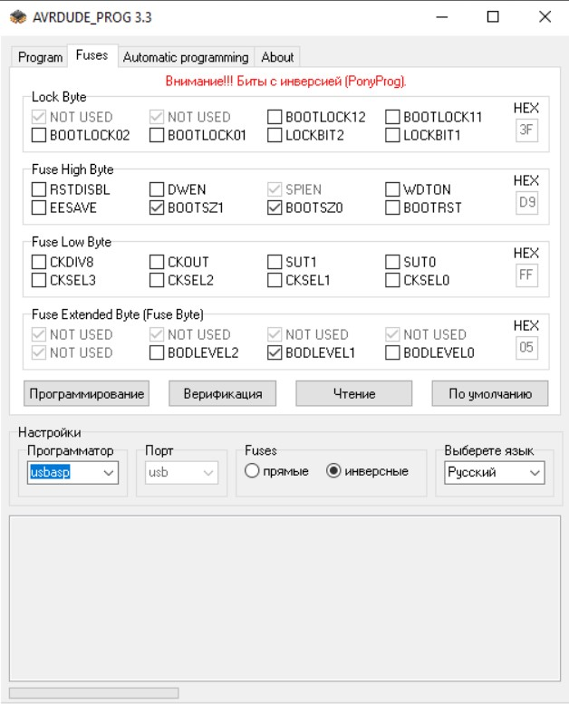

# Радиодатчик

Радиодатчик предназначен для работы с Монитором погоды BIM32. Он может работать в доме, или на улице. Питается от трех батареек типа АААА (LR61). На данный момент радиодатчик поддерживает следующие датчики:
 * BME280 - датчик температуры, влажности и атмосферного давления
 * SHT21 - датчик температуры и влажности
 * DS18B20 - датчик температуры (можно подключить сразу четыре таких датчика)
 * MAX44009 - датчик уровня освещенности
 * PZEM-004t - измеритель электроэнергии (напряжение, ток, мощьность, потребленная энергия, частота сети) 
 * SenseAir S8 - датчик CO2

Конечно, подключать нужно не все из этого списка, а только те датчики которые вам нужны.

Радиодатчик основан на МК Atmega328p и радиомодуле HC-12. Данный радиомодуль работает на частоте: от 433,4 до 473,0 МГц и обещает дальность передачи информации до 1800 метров. 

## Схема радиодатчика
Сам **радиодатчик** можно собрать на модуле **Arduino Nano**, или любом другом модуле построенном на **atmega328p**. В этом случае схема, сборка и прошивка **радиодатчика** будут максимально простыми, но в таком виде об автомном питании датчика можно забыть.

Или можно пойти более сложным путем, собрать **радиодатчик** из *рассыпухи* и прошить его программатором. В этом случае **радиодатчик** сможет прожить от трех пальчиковых батареек более года.

## Прошивка радиодатчика
Чтоб прошить **радиодатчик** нужно открыть проект в Arduino IDE, перейти во вкладку **config.h** и раскомментировать (убрать символы **//** в начале строки) нужные датчики. Если у вас 2 радиодатчика - в конце этого файла в строчке **const int SENSOR_NUMBER = 0;** для первого датчика оставьте значение **0**, а для второго измените **0** на **1**.

Если ваш датчик собран на **Arduino модуле** то просто прошейте его как обычно, через Ардуино IDE. 

А если на ***рассыпухе*** - выберите в Arduino IDE **Инструменты** -> **Программатор** -> **Ваш тип программатора**

Затем кликните в меню **Скетч** -> **Загрузить через программатор**

В случае, если в Ардино нет вашего программатора - выберите в меню **Скетч** -> **Экспорт бинарного файла**. 

После компиляции в папке проекта появятся два **.hex** файла, вам нужен **BIM32_Radio-sensor.ino.eightanaloginputs.hex**, его и нужно зашить в **atmega328p** при помощи программатора. Фьюзы выставьте как на скрине ниже.

