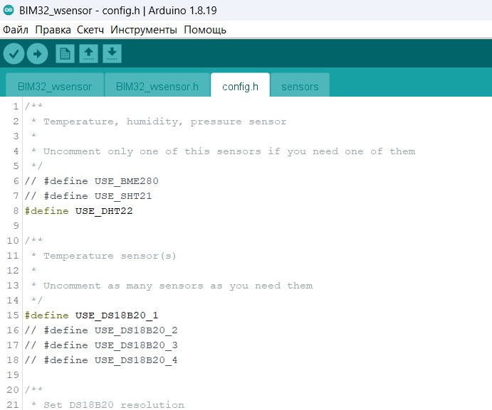
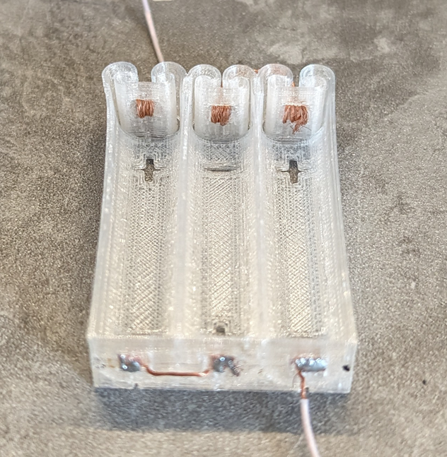
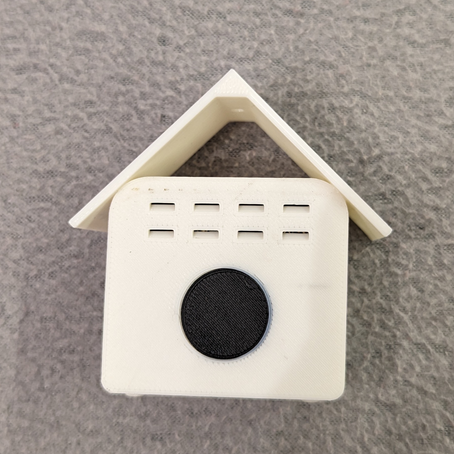

# Радиодатчик

Радиодатчик предназначен для работы с <a href="https://github.com/himikat123/Weather-monitor-BIM32">Монитором погоды BIM32.</a> Он может работать в доме, или на улице. Питается от трех батареек типа АААА (LR61). Также, питать датчик можно от Li-Ion аккумулятора, но от батареек предпочтительнее, так как батарейкам не страшен уличный мороз.

На данный момент радиодатчик поддерживает следующие датчики:
 * BME280 - датчик температуры, влажности и атмосферного давления
 * SHT21 - датчик температуры и влажности
 * DS18B20 - датчик температуры (можно подключить сразу четыре таких датчика)
 * MAX44009 - датчик уровня освещенности
 * PZEM-004t - измеритель электроэнергии (напряжение, ток, мощность, потребленная энергия, частота сети) 
 * SenseAir S8 - датчик CO2

Конечно, подключать нужно не все из этого списка, а только те датчики которые вам нужны.

В качестве дополнения, можно добавить 4-х разрядный 7-сегментный дисплей на MAX1637. Выводить на дисплей можно только температуру, только с одного датчика температуры. Это экспериментальная функция, возможно в будущем я ее удалю.

Радиодатчик основан на МК Atmega328p и радиомодуле HC-12. Данный радиомодуль работает на частоте: от 433,4 до 473,0 МГц и обещает дальность передачи информации до 1800 метров. 

## Схема радиодатчика
Сам **радиодатчик** можно собрать на модуле **Arduino Nano**, или любом другом модуле построенном на **atmega328p**. В этом случае схема, сборка и прошивка **радиодатчика** будут максимально простыми, но в таком виде об автомном питании датчика можно забыть.

Или можно пойти более сложным путем, собрать **радиодатчик** из *рассыпухи* и прошить его программатором. В этом случае **радиодатчик** сможет прожить от трех пальчиковых батареек более года.

## Прошивка радиодатчика
Чтоб прошить **радиодатчик** нужно открыть проект в Arduino IDE, перейти во вкладку **config.h** и раскомментировать (убрать символы **//** в начале строки) нужные датчики. Если у вас 2 радиодатчика - в конце этого файла в строчке **const int SENSOR_NUMBER = 0;** для первого датчика оставьте значение **0**, а для второго измените **0** на **1**.

Если ваш датчик собран на **Arduino модуле** то просто прошейте его как обычно, через Ардуино IDE. 

А если на ***рассыпухе*** - выберите в Arduino IDE **Инструменты** -> **Программатор** -> **Ваш тип программатора**

Затем кликните в меню **Скетч** -> **Загрузить через программатор**

В случае, если в Ардино нет вашего программатора - выберите в меню **Скетч** -> **Экспорт бинарного файла**. 

После компиляции в папке проекта появятся два **.hex** файла, вам нужен **BIM32_Radio-sensor.ino.eightanaloginputs.hex**, его и нужно зашить в **atmega328p** при помощи программатора. Фьюзы выставьте как на скрине ниже.

# Фотоинструкция по сборке напечатанного на 3д принтере корпуса

Корпус расчитан на три батарейки типа АААА (или LR61). Почему именно они? Они довольно маленькие, но достаточно ёмкие. Можно конечно применить любые другие, но корпус расчитан на эти. Батарейки АААА не в любом магазине продаются и стоимость их заметно выше чем ААА или АА. Поэтому, дешевле и проще добыть такие батарейки из 9-вольтовой батарейки "Крона" (6LR61), там их целых шесть штук.

Дальше, нам понадобится полностью собранная и проверенная в работе плата

Затем, нужно распечатать на 3д принтере держатель для батареек. Печатать его желательно материалом TPU, он как силикон, можно изгибать, он пружинит и при этом не ломается. Контакты для батареек я сделал из провода МГТФ, там для этого уже есть специальные отверстия.

Все остальные детали корпуса напечатаны материалом ASA. 

Далее нужно установить резьбовые втулки (бонки)

Дальше, надеюсь, по фоткам будет понятно как что собирать

## Нравится проект? Купи мне кофе, или пиво.

